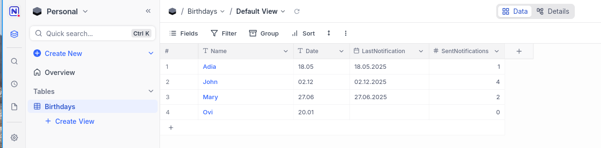
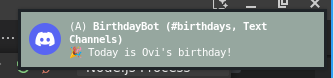

# Birthday Notification Bot

## Service branch

This branch is for running the script as a service on system boot rather than as a cronjob.
The service file is located in `service/birthday-notification.service`
Change the paths accordingly as well as the username and the userId on this line:
`Environment=DBUS_SESSION_BUS_ADDRESS=unix:path=/run/user/1000/bus`

---

A Node.js application that sends birthday notifications to a Discord channel using data from a NocoDB table.




## Features

- Fetches birthday data from a NocoDB table
- Sends notifications to a Discord webhook when it's someone's birthday
- Updates notification status in NocoDB
- Runs on a schedule using cron

## Requirements

- Node.js (v14+ recommended)
- Access to a NocoDB instance (with API key)
- Discord webhook URL

## Setup

1. **Clone the repository:**
   ```bash
   git clone https://github.com/3dprogramin/birthday-notification.git
   cd birthday-notification
   ```

2. **Install dependencies:**
   ```bash
   npm install
   ```

3. **Configure environment variables:**
   Set the following environment variables (e.g., in a `.env` file or your shell):
   - `NOCODB_URL` - Base URL of your NocoDB instance (e.g., `https://localhost:8080`)
   - `NOCODB_API_KEY` - Your NocoDB API key
   - `NOCODB_TABLE_ID` - The table ID to fetch birthdays from

4. **Run the bot:**
   ```bash
   node index.js
   ```

## File Structure

- `index.js` - Main entry point, schedules and runs the notification logic
- `modules/nocodb.js` - Handles NocoDB API interactions
- `modules/logger.js` - Logging utility
- `modules/env.js` - (Optional) Environment variable management

## Security Note

This project disables TLS certificate verification for local development with self-signed certificates.

## License

MIT
